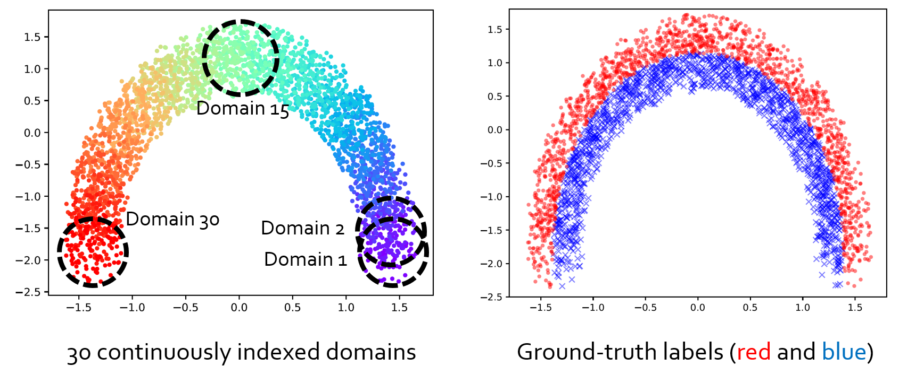
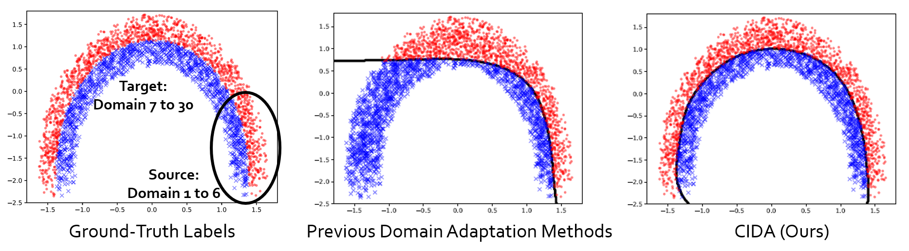
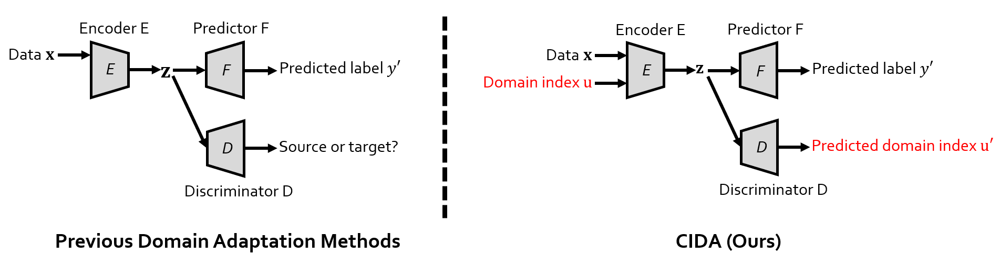
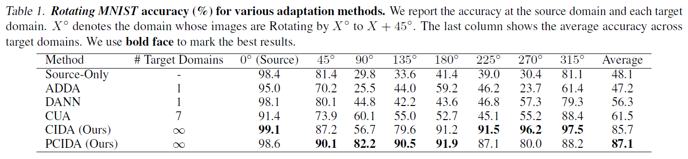
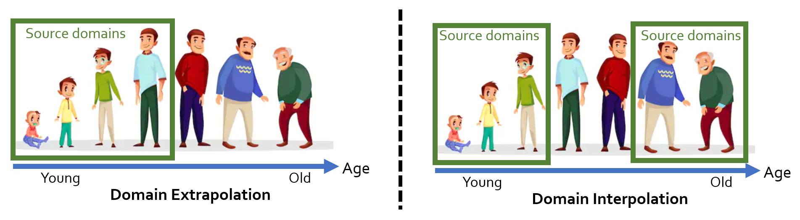
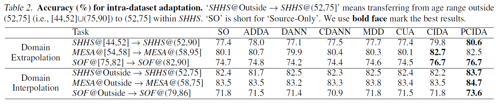
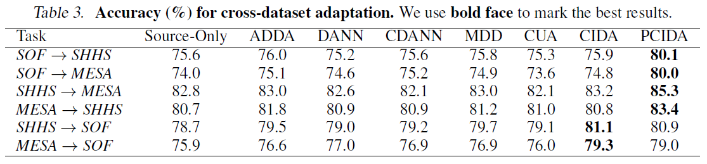
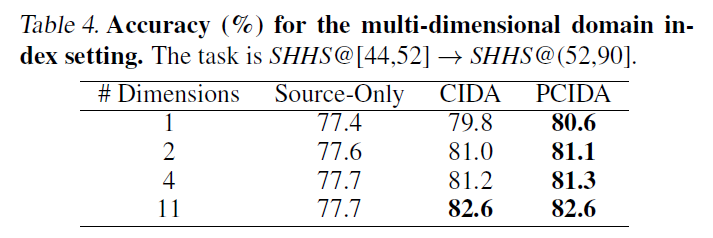

# Continuously Indexed Domain Adaptation (CIDA)
This is the authors' official PyTorch implementation for CIDA. This repo contains code for experiments in the **ICML 2020** paper '[Continuously Indexed Domain Adaptation](http://wanghao.in/paper/ICML20_CIDA.pdf)'.

## Outline for This README
* [Beyond Domain Adaptation: Brief Introduction for CIDA](https://github.com/hehaodele/CIDA#beyond-domain-adaptation-brief-introduction-for-cida)
* [Sample Results](https://github.com/hehaodele/CIDA#sample-results)
* [Method Overview](https://github.com/hehaodele/CIDA#method-overview)
* [IPython Notebooks and Environment](https://github.com/hehaodele/CIDA#ipython-notebooks-and-environment)
* [Quantitative Results](https://github.com/hehaodele/CIDA#quantitative-results)
* [Theory](https://github.com/hehaodele/CIDA#theory)
* [Reference](https://github.com/hehaodele/CIDA#reference)

## Beyond Domain Adaptation: Brief Introduction for CIDA
Essentially CIDA asks the question of whether and how to **go beyond current (categorical) domain adaptation regime** and proposes **the first approach to adapt across continuously indexed domains**. For example, instead of adapting from domain A to domain B, we would like to simultaneously adapt across infintely many domains in a manifold. This allows us to go beyond domain adaption and perform both [domain interpolation](https://github.com/hehaodele/CIDA#intra-dataset-results-on-real-world-medical-datasets) and [domain extrapolation](https://github.com/hehaodele/CIDA#intra-dataset-results-on-real-world-medical-datasets). See the following toy example.

<p align="center">

</p>

For a more **visual** introduction, feel free to take a look at this [video](https://www.youtube.com/watch?v=KtZPSCD-WhQ).

## Sample Results
If we use domains [1, 6] as source domains and the rest as target domains, below are some sample results from previous domain adaptation methods and CIDA, where CIDA successfully learns how the decision boundary evolves with the domain index.
<p align="center">

</p>

## Method Overview
We provide a simple yet effective learning framework with **theoretical guarantees** (see the [Theory section](https://github.com/hehaodele/CIDA#theory) at the end of this README). Below is a quick comparison between previous domain adaptation methods and CIDA (differences marked in red). 
* Previous domain adaptation methods use a discriminator is classifify different domains (as categorical values), while CIDA's discriminator directly regresses the domain indices (as continuous values).
* Previous domain adaptation methods' encoders ignore domain IDs, while CIDA takes the domain index as input.
<p align="center">

</p>

## IPython Notebooks and Environment
Below are some IPython Notebooks for the experiments. We strongly recommend starting from the simplest case, i.e., [Experiments for Toy Datasets (Quarter Circle)](toy-circle/main-quarter-circle.ipynb) to get familar with the data and settings. 
#### IPython Notebooks
* [Experiments for Toy Datasets (Quarter Circle)](toy-circle/main-quarter-circle.ipynb)
* [Experiments for Toy Datasets (Half Circle)](toy-circle/main-half-circle.ipynb)
* [Experiments for Toy Datasets (Sine)](toy-sine/main-sine-CIDA.ipynb)
* [Experiments for Rotating MNIST](rotatingMNIST/main.ipynb)

Besides using IPython notebooks, you can also directly run the following command for the Rotating MNIST experiments inside the folder 'rotatingMNIST':
```
bash run_all_exp.sh
```

#### Environment
* Python 3.6
* PyTorch 1.5.1
* Numpy 1.19

## Quantitative Results
#### Rotating MNIST
<p align="center">

</p>

#### Intra-Dataset Results on Real-World Medical Datasets
In the intra-dataset setting, we consider both **domain extrapolation** and **domain interpolation** (see the figure below).
<p align="center">

</p>
<p align="center">

</p>

#### Cross-Dataset Results on Real-World Medical Datasets
<p align="center">

</p>

#### Multi-Dimensional CIDA on Real-World Medical Datasets
<p align="center">

</p>

## Theory
Denoting the domain index as *u* and the encoding as ***z***, we have (check the [paper](http://wanghao.in/paper/ICML20_CIDA.pdf) for full theorems):
* **Theorem 1** (Informal). CIDA converges, *if and only if*, the expectation of domain index 𝔼[*𝑢* | ***z***] is identical for any embedding ***z***.
* **Theorem 2** (Informal). PCIDA converges, *if and only if*, the expectation and the variance of domain index, 𝔼[𝑢 | ***z***] and 𝕍[𝑢 | ***z***] are identical for any ***z***.
* **Theorem 3** (Informal). The global optimum of the two-player game between 𝐸 and 𝐷 matches the global optimum of the three-play game between 𝐸, 𝐹, and 𝐷.

## Also Check Out Relevant Work
**Graph-Relational Domain Adaptation**<br>
Zihao Xu, Hao He, Guang-He Lee, Yuyang Wang, Hao Wang<br>
*Tenth International Conference on Learning Representations (ICLR), 2022*<br>
[[Paper](http://www.wanghao.in/paper/ICLR22_GRDA.pdf)] [[Code]](https://github.com/Wang-ML-Lab/GRDA)


## Reference
[Continuously Indexed Domain Adaptation](http://wanghao.in/paper/ICML20_CIDA.pdf)
```bib
@inproceedings{DBLP:conf/icml/WangHK20,
  author    = {Hao Wang and
               Hao He and
               Dina Katabi},
  title     = {Continuously Indexed Domain Adaptation},
  booktitle = {ICML},
  year      = {2020}
}

```
