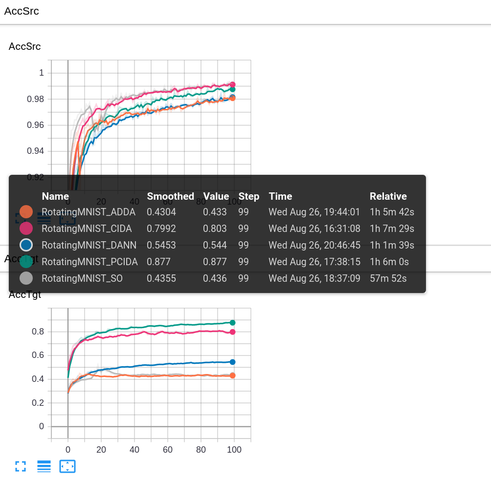

# Rotating MNIST Experiments
You could run experiments for Rotating MNIST either directly from [command line](rotatingMNIST/readme.md#train-model-via-command-line) or using the [IPython Notebook](rotatingMNIST/main.ipynb).

### Run Experiments (Train and Evaluate Models) via Command Line
```bash run_all_exp.sh```

### Run Experiments (Train/Evaluate Models and Visualize Results)  via IPython Notebook
* Cell 1: Dataset
* Cell 2: Configures (choice the model here)
* Cell 3: Train the model from scratch
* Cell 4: Load a pretrained model (you can skip cell 3 if use cell 4)
* Cell 5: Print the result of a model

### Visualize the Learning Curve
```bash
cd dump; tensorboard --logdir=.
```
You should the curve like this. 
<p align="center">

</p>  
